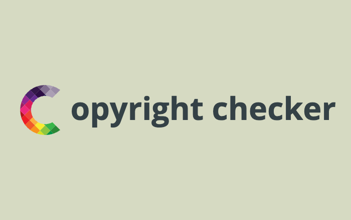

# Copyright Checker



The Copyright Checker is a powerful tool written in Go that helps you ensure the consistency of copyright notices across your project's files. It allows you to define patterns for copyright text and check if they match the files in your project, providing a convenient way to maintain proper copyright attribution.

## Features

- Supports file globbing and exclusion patterns to specify the files to be checked
- Allows the use of template variables for dynamic copyright text
- Provides customizable error messages when copyright text does not match
- Offers a straightforward command-line interface for easy integration into your development workflow

## Installation

To use the Copyright Checker, you'll need to have Go installed on your system. Once you have Go set up, you can clone the repository and build the binary:

```ShellSession
git clone https://github.com/elbars/copyright_checker.git
cd copyright_checker
go build -o copyright-checker main.go
```

This will create the **copyright-checker** executable, which you can then use to run the tool.

## Usage

The Copyright Checker can be run with the following command-line arguments:

``go run main.go [flags]``

or using the built binary:

``./copyright-checker [flags]``

Available flags:

- **-c** or **--config**: Path to the configuration file (default is config/config.yaml).
- **--filesglob**: Glob pattern for the files to be checked. The space in the argument is used as a delimeter to generate a list of files
- **--filesglobexclude**: Glob pattern for files to be excluded from the check. The space in the argument is used as a delimeter to generate a list of files.
- **--message**: Custom error message to be displayed when copyright text does not match.
- **--filespattern**: Path to the file containing the copyright pattern.
- **--templatedata**: JSON-formatted key-value pairs for the copyright pattern template.

If at least one mismatch is found, the program will exit with an exit code 1.

## Command-line mode usage:

```ShellSession
./copyright-checker --filesglob "samples/*" --filesglobexclude "*.go *.mod *.sum" --message "Pattern not matched in Python files" --filespattern "config/pattern.txt" --templatedata '{"year":"2024"}'
```

This command will check all files in the samples/ directory, excluding .go, .mod, and .sum files, using the copyright pattern defined in the config/pattern.txt file. The template data provided in the --templatedata flag will be used to customize the copyright pattern. If any files do not match the pattern, the custom error message "Pattern not matched in Python files" will be displayed.

```ShellSession
go run main.go --filesglob "samples/**" --filesglobexclude "**/*.go **/*.mod **/*.sum" --filespattern config/pattern.txt
```

In this example, a go run is used instead of launching a binary file, and the optional parameters message and templatedata are also omitted.

## Configuration mode usage:

The Copyright Checker can be configured using a YAML file. The default configuration file path is config/config.yaml, but you can specify a different path using the --config flag.

The configuration file should have the following structure:

```ShellSession
- id: example_id
  message: Copyright text not matching
  glob:
    - "samples/*"
  exclude:
    - "*.go"
    - "*.mod"
    - "*.sum"
  pattern:
    literal: "Copyright (c) {{.year}} Example Inc."
  vars:
    year: "2024"
```

Each entry in the configuration file represents a set of rules for checking copyright text. The **id** field is used to identify the rule and is rather of an informational nature in which you can place a short reference about the configuration, **message** is the error message to be displayed when the copyright text does not match, **glob** and **exclude** define the file patterns to be checked, pattern specifies the copyright text pattern (with optional template variables), and **vars** provides the values for the template variables. See example in config/config.yaml file.

```raw
Check mode using command line arguments has higher priority than checking through the configuration file
```

## Docker usage:
```ShellSession
docker build -t copyright-checker .
docker run -v `pwd`:/app elbars/copyright_checker --filesglob "samples/**" --filesglobexclude "**/*.go **/*.mod **/*.sum" --filespattern config/pattern.txt copyright-checker
docker run --rm -v `pwd`:/check copyright-checker --filesglob "/check/**" --filespattern config/pattern.txt
```

## Contributing

If you find any issues or have suggestions for improvements, feel free to open an issue or submit a pull request on the [GitHub repository](https://github.com/elbars/copyright_checker).

## License

This package is available under the [MIT license](LICENSE).